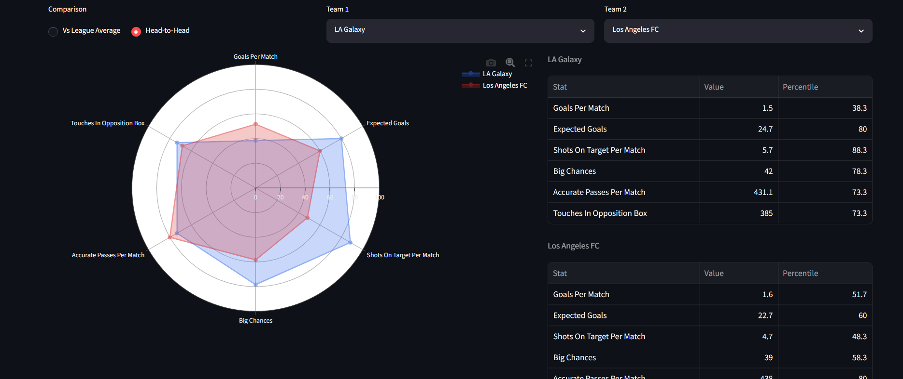
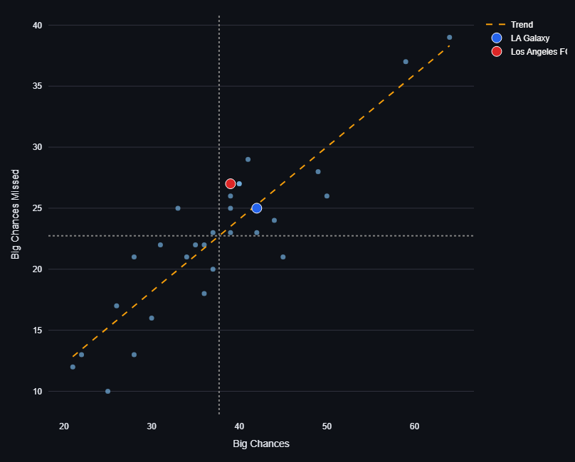

# Football Data Visualizer

A Streamlit app for visualizing soccer data for teams and players for a given
dataset of teams/players. This app features Football Manager style
percentile "wheel" (radar) charts and stat scatterplots with extensive
customization and filtering options.

## Features

- **Team or Individual stats**: upload a CSV of team stats or player stats (examples in files)
- **Percentile wheel**: pick a preset (or any 6 stats) and compare one
  team/player against the league average or head-to-head against another.
- **Scatter Explorer**: plot any two stats across every team/player in the
  file, with optional trend line, average reference lines, and position
  filtering. The wheel's selected entity/entities are highlighted on the plot.
- **Two dataset modes**:
  - `General` — dataset-agnostic presets seeded from FotMob exports for any extensive data sets.
  - `NCAA` — presets tuned for the NCAA soccer stat exports.
- **Sample Datasets**: sample stats for general teams/individuals (in `fotmob_files/`) and NCAA teams/individuals (in `ncaa_files/`)
- **Flexible CSVs**: stat columns are matched by alias, not exact name, so
  minor formatting differences (`GoalsPerGame` vs `goals_per_game`) still
  resolve automatically. Anything that can't be matched falls back to a
  manual column picker.



## Setup

```bash
pip install -r requirements.txt
streamlit run app.py
```

Then choose team/individual and upload a team or individual stats CSV.

## Project layout

```
app.py                  Streamlit entry point
src/
  config_loader.py      loads alias/preset YAML for a (dataset, mode) pair
  data_io.py             CSV loading + missing-value filtering
  stat_resolver.py       alias matching, display-name formatting
  percentiles.py         percentile computation (position-filterable)
  charts.py               wheel + scatter figure builders
config/
  {dataset}_{mode}_aliases.yaml           canonical stat -> column aliases
  {dataset}_{mode}_presets.yaml           wheel presets (6 stats each)
  {dataset}_{mode}_scatter_presets.yaml   scatter presets (x/y stat pairs)
ncaa_files/              NCAA sample data + R cleaning scripts
fotmob_files/            MLS/FotMob sample data
```

`dataset` is `general` or `ncaa`; `mode` is `team` or `individual`.

## Adding a new dataset

Drop in the six config files for a new `dataset` name
(`{dataset}_team_aliases.yaml`, `{dataset}_team_presets.yaml`,
`{dataset}_team_scatter_presets.yaml`, and the `individual` equivalents),
add the dataset to the radio options in `app.py`, and it picks up the same
UI automatically. Scatter presets are optional — if the file doesn't exist,
the app just falls back to a free "pick any two stats" picker.
